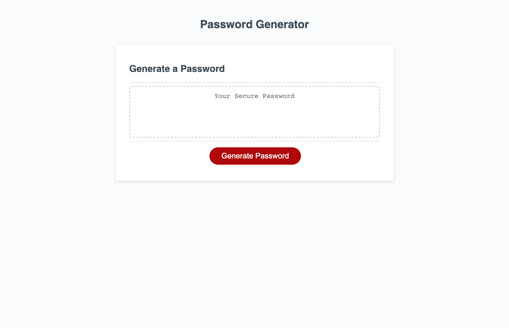

# challenge_3
***
## Description
This challenge is to create a password in which the user has provide a range of 8-128.  The user will have the ability to choose from the following criteria (with lower case as default):  lower case, upper case, numbers and characters.  Criteria is chosen when the user clicks on the OK button and is not chosen when cancel is clicked.  Not entering a number will terminate the program. 

## Links
github repository https://github.com/rypab4/challenge_3
github SSH git@github.com:rypab4/challenge_3.git
website https://rypab4.github.io/challenge_3/

## Directions

open website

click on the Generate Password button and the following will pop-up.
![alt text](./images/rypab4_github_io_says_and_Password_Generator.png

Add a number or else the following window will show:
![alt text](./images/rypab4_github_io_says_and_Password_Generator-2.png

After a number is entered a series of questions for the criteria of the passwords pop-up and OK means Yes and Cancel means No:
![alt text](./images/rypab4_github_io_says_and_Password_Generator-3.png

After all the questions a password is given in the box:
![alt text](./images/Password_Generator_done.png
